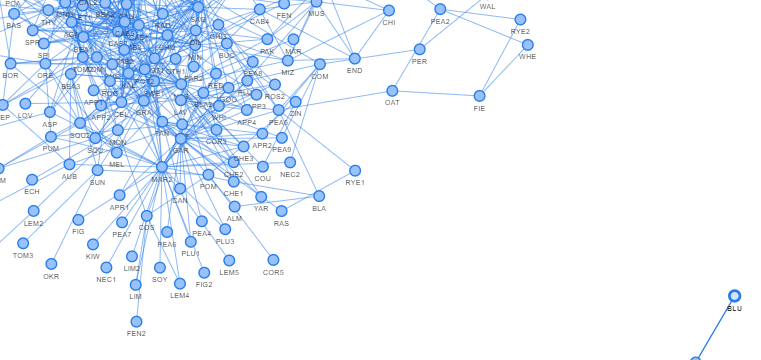

# Plant Companions

Plant companion network visualization using `networkx`. 

The aim of this project is to find plants with complimentary needs/attributes to recommend planting in networks or guilds. For example, beans give off nitrogen and need a trellis to grow against, and are thus ideal for planting with corn, which needs nitrogen and provides a 'pole' for vines. Squash compliments these plantings by providing soil cover, thus reducing water evaporation.